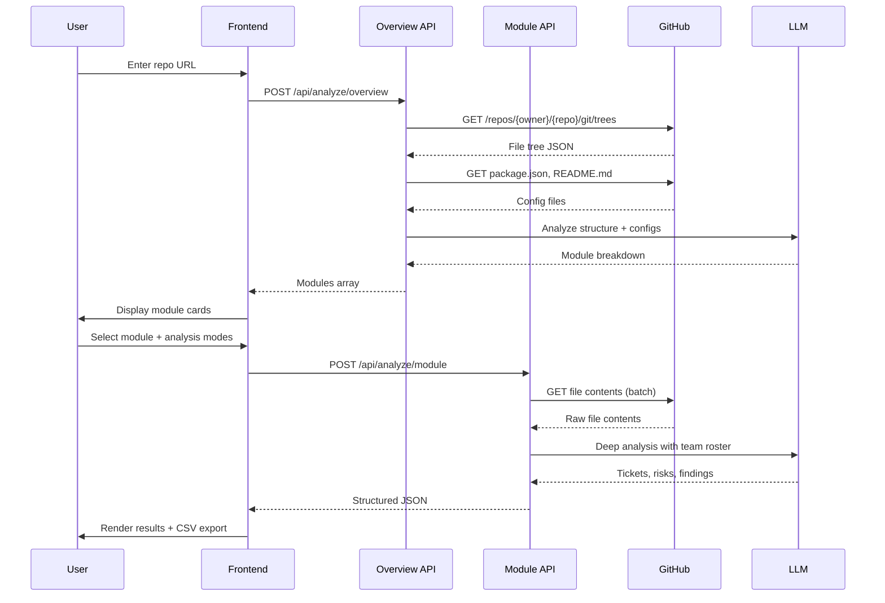

# Curious Bob - Technical Architecture

## Technology Stack (MVP Optimized)

### Frontend
- **Framework**: Next.js 14+ (App Router)
- **Styling**: Tailwind CSS + Material UI (MUI) components
- **UI Components**:
  - Material UI (MUI) for Material Design components
  - shadcn/ui for base utilities (kept for compatibility)
- **State Management**: React Context API (sufficient for MVP scope)
- **Diagrams**: Mermaid.js (native markdown support, no external rendering)
- **Type Safety**: TypeScript

### Backend
- **Runtime**: Next.js API Route Handlers
- **LLM Provider**: Google Gemini 1.5 Flash (fast, cost-effective, 1M token context)
- **GitHub Integration**: Octokit REST API
- **Rate Limiting**: Vercel Edge Config or in-memory cache
- **File Processing**: Stream-based parsing for large files

### Infrastructure
- **Hosting**: Vercel (optimized for Next.js, edge functions)
- **Environment Variables**: Vercel Environment Variables
- **Monitoring**: Vercel Analytics (built-in)
- **Error Tracking**: Vercel Logs (MVP), Sentry (future)

### Authentication Strategy
**Phase 1 (MVP)**: Anonymous GitHub API access (60 req/hour)
- Sufficient for demo and initial testing
- No auth complexity
- Clear upgrade path

**Phase 2 (Post-MVP)**: User-provided GitHub tokens
- Input field for optional PAT
- Stored in sessionStorage only
- Increases rate limit to 5000 req/hour

**Phase 3 (Production)**: OAuth GitHub App
- Full authentication flow
- Persistent user sessions
- Organization-level access

### Analysis Constraints (MVP)

| Constraint | Limit | Rationale |
|------------|-------|-----------|
| Max Repository Size | 100 MB | Prevents timeout, manageable token usage |
| Max Files per Module | 100 files | Gemini 1.5 Flash supports 1M token context |
| API Timeout (Overview) | 60 seconds | Vercel serverless function limit |
| API Timeout (Module) | 60 seconds | Vercel serverless function limit |
| Max File Size | 2 MB | Gemini handles larger files efficiently |
| Concurrent Analyses | 1 per session | Simplifies state management |

### Data Storage Strategy

**Session-Only (MVP)**:
- Team rosters: sessionStorage
- Analysis results: React state
- No database required
- Export to CSV for persistence

**Future Enhancements**:
- PostgreSQL (Vercel Postgres) for user accounts
- Redis for caching analysis results
- S3-compatible storage for large exports

## System Architecture

```mermaid
graph TB
    User[User Browser]
    UI[Next.js Frontend]
    API1[/api/analyze/overview]
    API2[/api/analyze/module]
    GitHub[GitHub API]
    Gemini[Google Gemini API]
    
    User -->|1. Submit Repo URL| UI
    UI -->|2. POST repo URL| API1
    API1 -->|3. Fetch tree| GitHub
    API1 -->|4. Fetch config files| GitHub
    API1 -->|5. Analyze structure| Gemini
    Gemini -->|6. Module breakdown| API1
    API1 -->|7. Return modules| UI
    
    UI -->|8. Select module| API2
    API2 -->|9. Fetch file contents| GitHub
    API2 -->|10. Deep analysis| Gemini
    Gemini -->|11. Tickets & findings| API2
    API2 -->|12. Return results| UI
    UI -->|13. Display & export| User
```

## Component Interaction Flow



## File Structure

```
ducson-app/
├── src/
│   ├── app/
│   │   ├── layout.tsx                 # Root layout
│   │   ├── page.tsx                   # Landing page
│   │   ├── analyze/
│   │   │   └── [repoId]/
│   │   │       ├── page.tsx           # Analysis dashboard
│   │   │       └── loading.tsx        # Loading state
│   │   └── api/
│   │       └── analyze/
│   │           ├── overview/
│   │           │   └── route.ts       # Phase 1 endpoint
│   │           └── module/
│   │               └── route.ts       # Phase 2 endpoint
│   ├── components/
│   │   ├── ui/                        # shadcn/ui components
│   │   ├── RepoInput.tsx              # URL input form
│   │   ├── ModuleCard.tsx             # Module selection card
│   │   ├── AnalysisModeSelector.tsx   # Checkbox group
│   │   ├── TeamRosterManager.tsx      # Team member editor
│   │   ├── TicketList.tsx             # Results display
│   │   ├── MermaidDiagram.tsx         # Diagram renderer
│   │   └── ExportButton.tsx           # CSV export
│   ├── lib/
│   │   ├── github/
│   │   │   ├── client.ts              # Octokit wrapper
│   │   │   ├── tree-parser.ts         # Filter & clean tree
│   │   │   └── content-fetcher.ts     # Batch file fetching
│   │   ├── llm/
│   │   │   ├── gemini-client.ts       # Gemini API wrapper
│   │   │   ├── prompts/
│   │   │   │   ├── overview.ts        # Phase 1 prompt
│   │   │   │   └── module.ts          # Phase 2 prompts
│   │   │   └── schema-validator.ts    # Zod schemas
│   │   ├── export/
│   │   │   └── csv-generator.ts       # JSON to CSV
│   │   └── utils/
│   │       ├── file-filters.ts        # Ignore patterns
│   │       └── token-counter.ts       # Estimate tokens
│   ├── types/
│   │   ├── github.ts                  # GitHub API types
│   │   ├── analysis.ts                # Analysis types
│   │   └── ticket.ts                  # Ticket schema
│   └── config/
│       ├── default-team.ts            # Default roles
│       └── analysis-modes.ts          # Mode definitions
├── public/
│   └── examples/                      # Sample outputs
├── plans/                             # This directory
├── .env.local.example
├── next.config.js
├── tailwind.config.ts
├── tsconfig.json
└── package.json
```

## API Rate Limiting Strategy

### GitHub API (Anonymous)
- 60 requests/hour per IP
- Cache tree responses (5 min TTL)
- Batch file content requests
- Show rate limit status to user

### Google Gemini API
- Token-based pricing (significantly cheaper than GPT-4)
- Gemini 1.5 Flash: $0.075 per 1M input tokens, $0.30 per 1M output tokens
- Rate limits: 15 RPM (requests per minute) for free tier, 1000 RPM for paid
- Estimate costs before analysis
- Stream responses for better UX
- Implement retry logic with exponential backoff

## Error Handling Strategy

### User-Facing Errors
- Repository not found
- Repository too large
- Rate limit exceeded
- Invalid repository URL
- Analysis timeout
- LLM API failure

### Error Response Format
```typescript
{
  error: {
    code: "REPO_TOO_LARGE",
    message: "Repository exceeds 100MB limit",
    details: {
      actualSize: "150MB",
      maxSize: "100MB"
    },
    suggestion: "Try analyzing a smaller repository or specific modules"
  }
}
```

## Performance Optimization

### Frontend
- Code splitting by route
- Lazy load heavy components
- Virtualized lists for large result sets
- Debounced search/filter inputs
- Optimistic UI updates

### Backend
- Parallel GitHub API requests where possible
- Stream LLM responses
- Compress API responses
- Cache frequently analyzed repos (future)

### Vercel Edge Functions (Future)
- Move tree parsing to edge
- Reduce cold start times
- Global CDN distribution

## Security Considerations

### Input Validation
- Validate GitHub URL format
- Sanitize repository owner/name
- Limit team roster size (max 50 members)
- Validate analysis mode selections

### API Security
- Rate limiting per IP
- CORS configuration
- Environment variable protection
- No sensitive data in client bundle

### Data Privacy
- No persistent storage of code
- Session-only analysis results
- Clear data on tab close
- No tracking or analytics (MVP)

## Scalability Path

### Phase 1: MVP (Current Plan)
- Single-tenant
- Session-based
- No database
- Manual exports

### Phase 2: Multi-User
- User authentication
- Saved analyses
- Team workspaces
- Shared exports

### Phase 3: Enterprise
- Organization accounts
- Private repository support
- Custom LLM models
- Advanced analytics
- API access for integrations