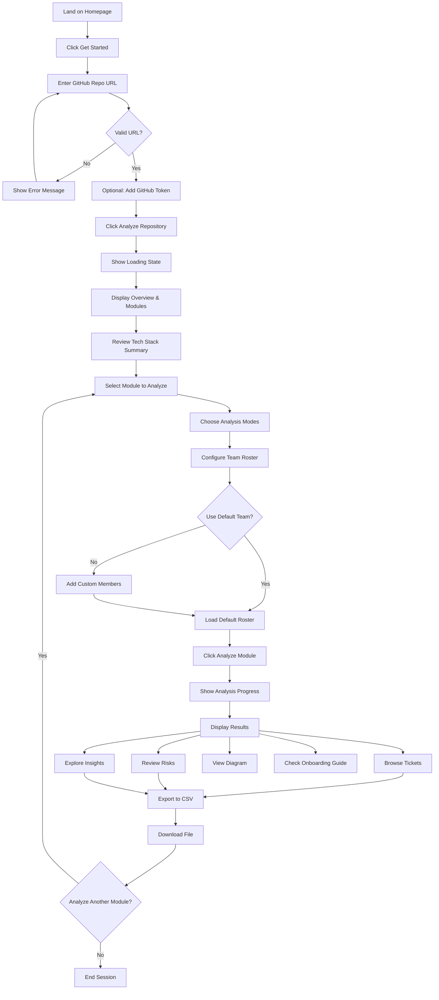
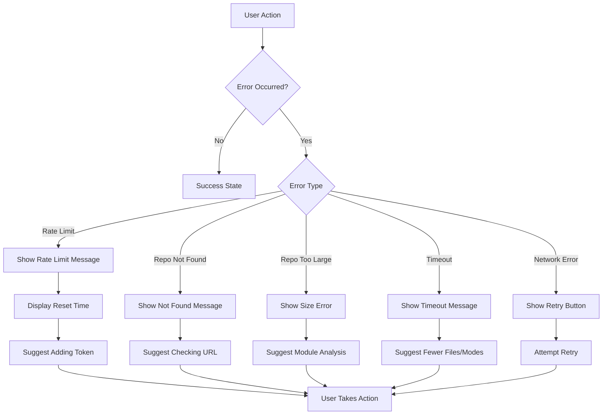

# Curious Bob - Frontend Design & User Flows

## Design System

### Material Design Integration
- **Primary Library**: Material UI (MUI) v5+
- **Base Components**: shadcn/ui (kept for utilities and compatibility)
- **Design Language**: Material Design 3 principles
- **Theme**: Flexible/customizable with Material Design tokens
- **Elevation**: Material Design elevation system (0-24dp)
- **Motion**: Material Design motion patterns (standard easing curves)

### Material UI Components Used
- **Layout**: `Container`, `Box`, `Grid`, `Stack`, `Paper`
- **Navigation**: `AppBar`, `Drawer`, `Tabs`, `Breadcrumbs`
- **Inputs**: `TextField`, `Button`, `Checkbox`, `Select`, `Autocomplete`
- **Data Display**: `Card`, `Chip`, `Badge`, `Table`, `List`
- **Feedback**: `CircularProgress`, `LinearProgress`, `Snackbar`, `Alert`
- **Surfaces**: `Paper`, `Accordion`, `Dialog`

## Component Hierarchy

```
App (layout.tsx)
├── MUI ThemeProvider
├── MUI CssBaseline
├── Navigation (MUI AppBar)
│   ├── Logo
│   └── ThemeToggle (MUI IconButton)
│
└── Page Routes
    ├── / (Landing Page)
    │   ├── Hero (MUI Container + Typography)
    │   ├── Features (MUI Grid + Card)
    │   ├── HowItWorks (MUI Stepper)
    │   └── CTASection (MUI Box + Button)
    │
    └── /analyze/[repoId] (Analysis Dashboard)
        ├── AnalysisHeader (MUI AppBar)
        │   ├── RepoInfo (MUI Typography + Chip)
        │   └── ProgressIndicator (MUI LinearProgress)
        │
        ├── Phase1: Overview (if not completed)
        │   ├── RepoInputForm (MUI Paper)
        │   │   ├── URLInput (MUI TextField)
        │   │   ├── TokenInput (MUI TextField with visibility toggle)
        │   │   └── AnalyzeButton (MUI Button)
        │   └── LoadingState (MUI CircularProgress + Skeleton)
        │
        ├── Phase2: Module Selection (after overview)
        │   ├── OverviewSummary (MUI Paper)
        │   │   ├── TechStackBadges (MUI Chip)
        │   │   ├── ArchitectureType (MUI Typography)
        │   │   └── SummaryText (MUI Typography)
        │   │
        │   ├── ModuleGrid (MUI Grid)
        │   │   └── ModuleCard[] (MUI Card with elevation)
        │   │       ├── ModuleName (MUI CardHeader)
        │   │       ├── FileCount (MUI Typography)
        │   │       ├── ComplexityBadge (MUI Chip)
        │   │       └── SuggestedModes (MUI Chip array)
        │   │
        │   ├── AnalysisConfiguration (MUI Paper)
        │   │   ├── AnalysisModeSelector (MUI FormGroup)
        │   │   │   └── ModeCheckbox[] (MUI Checkbox + FormControlLabel)
        │   │   └── TeamRosterManager (MUI List)
        │   │       ├── RosterList (MUI List + ListItem)
        │   │       ├── AddMemberButton (MUI Fab)
        │   │       └── UseDefaultButton (MUI Button)
        │   │
        │   └── AnalyzeModuleButton (MUI Button variant="contained")
        │
        └── Phase3: Results Display (after module analysis)
            ├── ResultsTabs (MUI Tabs + TabPanel)
            │   ├── TicketsTab
            │   │   ├── TicketFilters (MUI Select + Autocomplete)
            │   │   │   ├── CategoryFilter (MUI Select)
            │   │   │   ├── PriorityFilter (MUI Select)
            │   │   │   └── AssigneeFilter (MUI Autocomplete)
            │   │   └── TicketList (MUI Stack)
            │   │       └── TicketCard[] (MUI Card + CardContent)
            │   │           ├── TicketHeader (MUI CardHeader)
            │   │           ├── TicketDescription (MUI Typography)
            │   │           ├── CodeLocations (MUI List)
            │   │           └── SuggestedActions (MUI List)
            │   │
            │   ├── RisksTab
            │   │   └── RiskList (MUI Stack)
            │   │       └── RiskCard[] (MUI Alert + Card)
            │   │
            │   ├── InsightsTab
            │   │   ├── CodeQualityScore (MUI CircularProgress with label)
            │   │   ├── DependencyTable (MUI Table)
            │   │   ├── ArchitecturePatterns (MUI Chip array)
            │   │   └── TestCoverageEstimate (MUI LinearProgress)
            │   │
            │   ├── DiagramTab
            │   │   └── MermaidDiagram (MUI Paper)
            │   │
            │   └── OnboardingTab
            │       └── OnboardingGuide (MUI Stepper)
            │           └── ReadingOrderList (MUI List)
            │
            └── ExportSection (MUI SpeedDial)
                ├── ExportButton (MUI Button + Menu)
                └── ExportButton (Future: Jira, GitHub, Notion)
```

## User Flow Diagrams

### Primary User Journey



### Error Handling Flow



## Page Layouts

### Landing Page (`/`)

**Layout**: Single-page marketing site

**Sections**:
1. **Hero Section**
   - Headline: "Turn Legacy Code into Actionable Engineering Plans"
   - Subheadline: "AI-powered repository analysis that generates tickets, identifies risks, and creates onboarding guides"
   - CTA: "Analyze a Repository" (links to `/analyze/new`)
   - Demo GIF/Video

2. **Features Grid**
   - 🔍 Smart Module Detection
   - 🎫 Automated Ticket Generation
   - 🛡️ Security & Risk Analysis
   - 📊 Architecture Visualization
   - 👥 Team Assignment
   - 📥 Export to CSV/Jira/GitHub

3. **How It Works**
   - Step 1: Paste GitHub URL
   - Step 2: Select modules to analyze
   - Step 3: Get actionable tickets
   - Visual flow diagram

4. **Example Output**
   - Sample ticket card
   - Sample risk assessment
   - Sample diagram

5. **CTA Section**
   - "Ready to analyze your codebase?"
   - Button: "Get Started Free"

**Design Notes**:
- Dark mode support
- Responsive grid layout
- Smooth scroll animations
- Code syntax highlighting in examples

---

### Analysis Dashboard (`/analyze/[repoId]`)

**Layout**: Multi-phase wizard interface

#### Phase 1: Repository Input

```
┌─────────────────────────────────────────────────────┐
│  Curious Bob                              [🌙 Theme] │
├─────────────────────────────────────────────────────┤
│                                                       │
│              Analyze a GitHub Repository             │
│                                                       │
│  ┌─────────────────────────────────────────────┐   │
│  │ https://github.com/owner/repo               │   │
│  └─────────────────────────────────────────────┘   │
│                                                       │
│  ┌─────────────────────────────────────────────┐   │
│  │ GitHub Token (optional)          [?]        │   │
│  └─────────────────────────────────────────────┘   │
│                                                       │
│              [Analyze Repository]                    │
│                                                       │
│  Examples:                                           │
│  • https://github.com/vercel/next.js                │
│  • https://github.com/facebook/react                │
│                                                       │
└─────────────────────────────────────────────────────┘
```

#### Phase 2: Module Selection

```
┌─────────────────────────────────────────────────────┐
│  ← Back to Input              owner/repo    [Export] │
├─────────────────────────────────────────────────────┤
│                                                       │
│  Repository Overview                                 │
│  ┌─────────────────────────────────────────────┐   │
│  │ Tech Stack: Next.js • TypeScript • Postgres │   │
│  │ Architecture: Monolithic                     │   │
│  │ Summary: E-commerce platform with...        │   │
│  └─────────────────────────────────────────────┘   │
│                                                       │
│  Select Modules to Analyze                          │
│  ┌──────────┐ ┌──────────┐ ┌──────────┐           │
│  │ Auth     │ │ Payment  │ │ Inventory│           │
│  │ 12 files │ │ 8 files  │ │ 15 files │           │
│  │ [Medium] │ │ [High]   │ │ [Low]    │           │
│  │ ☑ Select │ │ ☐ Select │ │ ☐ Select │           │
│  └──────────┘ └──────────┘ └──────────┘           │
│                                                       │
│  Analysis Modes                                      │
│  ☑ Architecture Review    ☑ Security Audit         │
│  ☐ Scalability Audit      ☑ Refactor Planning      │
│  ☐ Dependency Risk        ☐ Onboarding Guide       │
│  ☐ Dead Code Detection    ☐ API Surface Mapping    │
│                                                       │
│  Team Roster                    [Use Default Team]  │
│  • Tech Lead                                         │
│  • Senior SWE                                        │
│  • Cybersecurity Engineer                           │
│  [+ Add Member]                                      │
│                                                       │
│              [Analyze Selected Module]              │
│                                                       │
└─────────────────────────────────────────────────────┘
```

#### Phase 3: Results Display

```
┌─────────────────────────────────────────────────────┐
│  ← Back to Modules            owner/repo    [Export] │
├─────────────────────────────────────────────────────┤
│                                                       │
│  Auth Module Analysis                               │
│  Analyzed: 12 files • 2,341 lines • 3 modes         │
│                                                       │
│  [Tickets] [Risks] [Insights] [Diagram] [Onboarding]│
│  ─────────────────────────────────────────────────  │
│                                                       │
│  Filters: [All Categories ▼] [All Priorities ▼]     │
│           [All Assignees ▼]  [Search...]            │
│                                                       │
│  ┌─────────────────────────────────────────────┐   │
│  │ CB-AUTH-001                    [High] 🔴     │   │
│  │ Split monolithic auth service               │   │
│  │ Assigned: Senior SWE                        │   │
│  │                                              │   │
│  │ The authentication module contains mixed... │   │
│  │                                              │   │
│  │ Files: src/services/auth.ts (2)             │   │
│  │ Functions: validateSession(), login...      │   │
│  │                                              │   │
│  │ Suggested Actions:                          │   │
│  │ 1. Extract JWT logic into separate service  │   │
│  │ 2. Create AuthService interface             │   │
│  │                                              │   │
│  │ [View Details] [Mark as Done]               │   │
│  └─────────────────────────────────────────────┘   │
│                                                       │
│  ┌─────────────────────────────────────────────┐   │
│  │ CB-AUTH-002                  [Critical] 🔴   │   │
│  │ Hardcoded JWT secret in source code         │   │
│  │ ...                                          │   │
│  └─────────────────────────────────────────────┘   │
│                                                       │
│  [Export All Tickets to CSV]                        │
│                                                       │
└─────────────────────────────────────────────────────┘
```

## Component Specifications

### 1. RepoInputForm (Material UI)

**Props**:
```typescript
interface RepoInputFormProps {
  onSubmit: (data: { repoUrl: string; githubToken?: string }) => void;
  isLoading: boolean;
  error?: string;
}
```

**Material UI Components**:
- `Paper` with elevation={2} for form container
- `TextField` with variant="outlined" for URL input
- `TextField` with `InputAdornment` for token visibility toggle
- `Button` variant="contained" for submit
- `CircularProgress` for loading state
- `Alert` severity="error" for error messages
- `Link` component for example repositories

**Features**:
- URL validation with real-time feedback using MUI helper text
- Optional token input with visibility toggle (MUI IconButton)
- Example links for quick testing (MUI Link)
- Loading state with MUI CircularProgress
- Error display with MUI Alert component

**Validation**:
- Must match GitHub URL pattern
- Show MUI helper text warning if no token provided
- Disable submit while loading (MUI Button disabled prop)

---

### 2. ModuleCard (Material UI)

**Props**:
```typescript
interface ModuleCardProps {
  module: Module;
  isSelected: boolean;
  onSelect: (moduleId: string) => void;
}
```

**Material UI Components**:
- `Card` with elevation={isSelected ? 8 : 2}
- `CardHeader` for module name
- `CardContent` for details
- `CardActions` for select button
- `Chip` for file count and complexity
- `Checkbox` for selection

**Visual States (Material Design)**:
- Default: elevation={2}, neutral surface color
- Hover: elevation={4}, subtle shadow increase
- Selected: elevation={8}, primary color tint
- Disabled: reduced opacity, no interaction

**Content**:
- Module name (MUI Typography variant="h6")
- File count badge (MUI Chip size="small")
- Complexity indicator (MUI Chip with color prop)
- Suggested analysis modes (MUI Chip array)
- Select checkbox (MUI Checkbox)

---

### 3. AnalysisModeSelector (Material UI)

**Props**:
```typescript
interface AnalysisModeSelectorProps {
  selectedModes: AnalysisMode[];
  onChange: (modes: AnalysisMode[]) => void;
}
```

**Material UI Components**:
- `FormGroup` for checkbox group
- `FormControlLabel` for each mode
- `Checkbox` with color="primary"
- `Tooltip` for descriptions
- `Alert` for validation warnings
- `Grid` for 2-column layout

**Layout**: MUI Grid with 2 columns on desktop, 1 on mobile

**Each Mode Shows**:
- Icon (MUI Icon component)
- Mode name (MUI FormControlLabel)
- Brief description (MUI Tooltip)
- Estimated time impact (MUI Typography variant="caption")

**Validation**:
- At least 1 mode must be selected
- Show MUI Alert severity="warning" if >4 modes

---

### 4. TeamRosterManager (Material UI)

**Props**:
```typescript
interface TeamRosterManagerProps {
  roster: TeamMember[];
  onChange: (roster: TeamMember[]) => void;
}
```

**Material UI Components**:
- `List` for team members
- `ListItem` with `ListItemText` for each member
- `IconButton` for remove action
- `Fab` (Floating Action Button) for add member
- `Dialog` for add member modal
- `TextField` for role/name inputs
- `Button` for modal actions

**Features**:
- List of current team members (MUI List)
- Add member button (MUI Fab with + icon)
- Remove member button (MUI IconButton per member)
- "Use Default Team" quick action (MUI Button variant="outlined")
- Drag-to-reorder using MUI sortable list (future)

**Add Member Modal (MUI Dialog)**:
- Role input (MUI TextField or Autocomplete)
- Optional name input (MUI TextField)
- Save/Cancel buttons (MUI Button)

---

### 5. TicketCard (Material UI)

**Props**:
```typescript
interface TicketCardProps {
  ticket: Ticket;
  onViewDetails: (ticketId: string) => void;
  onMarkDone?: (ticketId: string) => void;
}
```

**Material UI Components**:
- `Card` with elevation={2}
- `CardHeader` for ID and priority
- `CardContent` for details
- `CardActions` for buttons
- `Chip` for priority badge
- `Typography` for text content
- `List` for files and actions
- `Button` for actions

**Layout** (Material Design):
```
┌─────────────────────────────────────────┐
│ CardHeader                              │
│ ID (subtitle)    Priority Chip (action) │
│ Title (title)                           │
│                                          │
│ CardContent                             │
│ Assigned: Role (Typography)             │
│                                          │
│ Description (Typography body2)          │
│                                          │
│ Files: Chip array                       │
│ Functions: Chip array                   │
│                                          │
│ Suggested Actions: List                 │
│ • Action one (ListItem)                 │
│ • Action two (ListItem)                 │
│                                          │
│ CardActions                             │
│ [View Details] [Mark as Done]           │
└─────────────────────────────────────────┘
```

**Priority Colors (Material Design)**:
- Critical: error.main (#d32f2f)
- High: warning.main (#ed6c02)
- Medium: info.main (#0288d1)
- Low: success.main (#2e7d32)

---

### 6. MermaidDiagram (Material UI)

**Props**:
```typescript
interface MermaidDiagramProps {
  content: string;
  description: string;
}
```

**Material UI Components**:
- `Paper` with elevation={1} for container
- `Box` for diagram wrapper
- `IconButton` for zoom controls
- `SpeedDial` for actions (download, fullscreen)
- `Alert` for error messages
- `Typography` for description

**Features**:
- Client-side Mermaid rendering in MUI Paper
- Zoom controls (MUI IconButton)
- Download as PNG/SVG (MUI SpeedDial actions)
- Fullscreen mode (MUI Dialog)
- Error handling with MUI Alert

**Implementation**:
```typescript
import mermaid from 'mermaid';
import { useEffect, useRef } from 'react';
import { Paper, Box, IconButton } from '@mui/material';

mermaid.initialize({
  startOnLoad: false,
  theme: 'default',
  securityLevel: 'loose'
});
```

---

### 7. ExportButton (Material UI)

**Props**:
```typescript
interface ExportButtonProps {
  data: Ticket[] | Risk[];
  filename: string;
  format: 'csv' | 'json';
}
```

**Material UI Components**:
- `Button` variant="contained" with startIcon
- `Menu` for format selection
- `MenuItem` for each format option
- `CircularProgress` for loading state
- `Snackbar` with `Alert` for success message

**Features**:
- Generate CSV/JSON on click
- Trigger browser download
- Show MUI Snackbar with success message
- Loading state with MUI CircularProgress

**CSV Generation**:
```typescript
const generateCSV = (tickets: Ticket[]) => {
  const headers = ['ID', 'Title', 'Category', 'Priority', ...];
  const rows = tickets.map(t => [t.id, t.title, ...]);
  return [headers, ...rows].map(row => row.join(',')).join('\n');
};
```

---

## Responsive Design Breakpoints (Material UI)

Material UI uses the following breakpoints:
```typescript
/* Material UI Breakpoints */
/* xs: 0px - 600px (Mobile) */
- Single column layout (Grid xs={12})
- Stacked cards
- Collapsible sections (MUI Accordion)
- Bottom sheet modals (MUI Drawer anchor="bottom")

/* sm: 600px - 900px (Tablet) */
- 2-column grid for modules (Grid sm={6})
- Side-by-side filters
- Slide-over panels (MUI Drawer)

/* md: 900px - 1200px (Small Desktop) */
- 3-column grid for modules (Grid md={4})
- Fixed sidebar navigation (MUI Drawer variant="permanent")
- Modal dialogs (MUI Dialog)

/* lg: 1200px+ (Large Desktop) */
- 4-column grid option (Grid lg={3})
- Enhanced hover interactions
- Expanded navigation
```

**Responsive Utilities**:
- Use MUI `useMediaQuery` hook for conditional rendering
- Use MUI `sx` prop with breakpoint-specific styles
- Use MUI `Grid` with responsive props (xs, sm, md, lg, xl)

## Loading States

### Skeleton Screens

**Overview Loading**:
```
┌─────────────────────────────────────┐
│ ████████████████                    │
│ ████████████                        │
│                                     │
│ ▓▓▓▓▓▓▓  ▓▓▓▓▓▓▓  ▓▓▓▓▓▓▓         │
│ ▓▓▓▓▓▓▓  ▓▓▓▓▓▓▓  ▓▓▓▓▓▓▓         │
└─────────────────────────────────────┘
```

**Module Analysis Loading**:
```
Analyzing Auth Module...
[████████████░░░░░░░░] 65%

• Fetching file contents... ✓
• Analyzing code structure... ⏳
• Generating tickets... ⏳
• Creating diagram... ⏳
```

### Progress Indicators

**Determinate**: Show percentage when possible
**Indeterminate**: Spinner for unknown duration
**Estimated Time**: "This usually takes 30-60 seconds"

---

## Accessibility (a11y)

### WCAG 2.1 AA Compliance

**Keyboard Navigation**:
- Tab through all interactive elements
- Enter/Space to activate buttons
- Arrow keys for radio/checkbox groups
- Escape to close modals

**Screen Reader Support**:
- Semantic HTML (`<main>`, `<nav>`, `<article>`)
- ARIA labels for icons
- ARIA live regions for dynamic content
- Skip to main content link

**Color Contrast**:
- Text: 4.5:1 minimum
- Large text: 3:1 minimum
- Interactive elements: 3:1 minimum

**Focus Indicators**:
- Visible focus ring (2px solid)
- High contrast mode support

---

## State Management

### Context Structure

```typescript
// AnalysisContext.tsx
interface AnalysisState {
  repository: Repository | null;
  overview: OverviewResponse | null;
  selectedModule: Module | null;
  analysisResult: ModuleAnalysisResponse | null;
  teamRoster: TeamMember[];
  selectedModes: AnalysisMode[];
  isLoading: boolean;
  error: string | null;
}

interface AnalysisActions {
  setRepository: (repo: Repository) => void;
  setOverview: (overview: OverviewResponse) => void;
  selectModule: (module: Module) => void;
  setAnalysisResult: (result: ModuleAnalysisResponse) => void;
  updateTeamRoster: (roster: TeamMember[]) => void;
  toggleAnalysisMode: (mode: AnalysisMode) => void;
  reset: () => void;
}
```

### Local Storage

**Persisted Data**:
- Last used team roster
- Theme preference
- Recent repositories (last 5)

**Session Storage**:
- Current analysis state
- GitHub token (if provided)

---

## Animation & Transitions

### Micro-interactions

**Button Hover**: Scale 1.02, shadow increase
**Card Select**: Border color transition (200ms)
**Modal Open**: Fade in + slide up (300ms)
**Toast Notification**: Slide in from top (200ms)

### Page Transitions

**Route Changes**: Fade out/in (150ms)
**Tab Switches**: Slide left/right (200ms)
**Accordion Expand**: Height transition (300ms)

### Loading Animations

**Spinner**: Rotate 360deg (1s infinite)
**Skeleton**: Shimmer effect (1.5s infinite)
**Progress Bar**: Width transition (smooth)

---

## Error States

### Empty States

**No Modules Found**:
```
┌─────────────────────────────────────┐
│         🔍                          │
│                                     │
│   No modules detected               │
│                                     │
│   This repository might be too      │
│   small or have an unusual          │
│   structure.                        │
│                                     │
│   [Try Another Repository]          │
└─────────────────────────────────────┘
```

**No Tickets Generated**:
```
┌─────────────────────────────────────┐
│         ✅                          │
│                                     │
│   No issues found!                  │
│                                     │
│   This module appears to be in      │
│   good shape. Consider analyzing    │
│   with different modes.             │
│                                     │
│   [Change Analysis Modes]           │
└─────────────────────────────────────┘
```

### Error Messages

**User-Friendly Format**:
- Clear headline
- Explanation of what went wrong
- Actionable next steps
- Support contact (if needed)

**Example**:
```
❌ Analysis Failed

We couldn't complete the analysis due to a timeout.

This usually happens when:
• The module has too many files
• Multiple analysis modes are selected

Try:
• Selecting fewer files
• Choosing 1-2 analysis modes
• Analyzing a smaller module

[Try Again] [Contact Support]