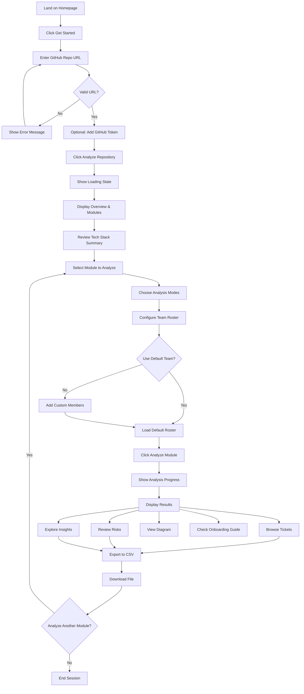
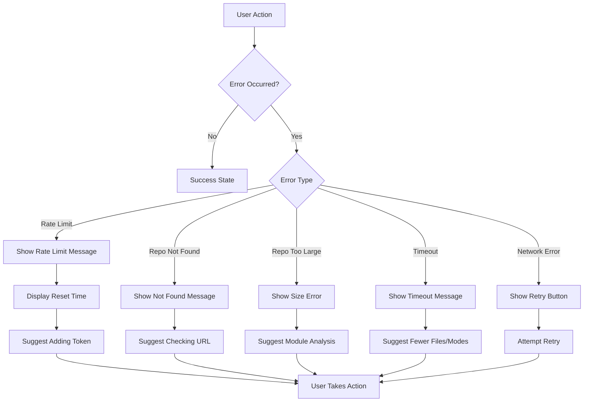

# Curious Bob - Frontend Design & User Flows

## Component Hierarchy

```
App (layout.tsx)
├── Navigation
│   ├── Logo
│   └── ThemeToggle
│
└── Page Routes
    ├── / (Landing Page)
    │   ├── Hero
    │   ├── Features
    │   ├── HowItWorks
    │   └── CTASection
    │
    └── /analyze/[repoId] (Analysis Dashboard)
        ├── AnalysisHeader
        │   ├── RepoInfo
        │   └── ProgressIndicator
        │
        ├── Phase1: Overview (if not completed)
        │   ├── RepoInputForm
        │   │   ├── URLInput
        │   │   ├── TokenInput (optional)
        │   │   └── AnalyzeButton
        │   └── LoadingState
        │
        ├── Phase2: Module Selection (after overview)
        │   ├── OverviewSummary
        │   │   ├── TechStackBadges
        │   │   ├── ArchitectureType
        │   │   └── SummaryText
        │   │
        │   ├── ModuleGrid
        │   │   └── ModuleCard[] (selectable)
        │   │       ├── ModuleName
        │   │       ├── FileCount
        │   │       ├── ComplexityBadge
        │   │       └── SuggestedModes
        │   │
        │   ├── AnalysisConfiguration
        │   │   ├── AnalysisModeSelector
        │   │   │   └── ModeCheckbox[]
        │   │   └── TeamRosterManager
        │   │       ├── RosterList
        │   │       ├── AddMemberButton
        │   │       └── UseDefaultButton
        │   │
        │   └── AnalyzeModuleButton
        │
        └── Phase3: Results Display (after module analysis)
            ├── ResultsTabs
            │   ├── TicketsTab
            │   │   ├── TicketFilters
            │   │   │   ├── CategoryFilter
            │   │   │   ├── PriorityFilter
            │   │   │   └── AssigneeFilter
            │   │   └── TicketList
            │   │       └── TicketCard[]
            │   │           ├── TicketHeader
            │   │           ├── TicketDescription
            │   │           ├── CodeLocations
            │   │           └── SuggestedActions
            │   │
            │   ├── RisksTab
            │   │   └── RiskList
            │   │       └── RiskCard[]
            │   │
            │   ├── InsightsTab
            │   │   ├── CodeQualityScore
            │   │   ├── DependencyTable
            │   │   ├── ArchitecturePatterns
            │   │   └── TestCoverageEstimate
            │   │
            │   ├── DiagramTab
            │   │   └── MermaidDiagram
            │   │
            │   └── OnboardingTab
            │       └── OnboardingGuide
            │           └── ReadingOrderList
            │
            └── ExportSection
                ├── ExportButton (CSV)
                └── ExportButton (Future: Jira, GitHub, Notion)
```

## User Flow Diagrams

### Primary User Journey



### Error Handling Flow



## Page Layouts

### Landing Page (`/`)

**Layout**: Single-page marketing site

**Sections**:
1. **Hero Section**
   - Headline: "Turn Legacy Code into Actionable Engineering Plans"
   - Subheadline: "AI-powered repository analysis that generates tickets, identifies risks, and creates onboarding guides"
   - CTA: "Analyze a Repository" (links to `/analyze/new`)
   - Demo GIF/Video

2. **Features Grid**
   - 🔍 Smart Module Detection
   - 🎫 Automated Ticket Generation
   - 🛡️ Security & Risk Analysis
   - 📊 Architecture Visualization
   - 👥 Team Assignment
   - 📥 Export to CSV/Jira/GitHub

3. **How It Works**
   - Step 1: Paste GitHub URL
   - Step 2: Select modules to analyze
   - Step 3: Get actionable tickets
   - Visual flow diagram

4. **Example Output**
   - Sample ticket card
   - Sample risk assessment
   - Sample diagram

5. **CTA Section**
   - "Ready to analyze your codebase?"
   - Button: "Get Started Free"

**Design Notes**:
- Dark mode support
- Responsive grid layout
- Smooth scroll animations
- Code syntax highlighting in examples

---

### Analysis Dashboard (`/analyze/[repoId]`)

**Layout**: Multi-phase wizard interface

#### Phase 1: Repository Input

```
┌─────────────────────────────────────────────────────┐
│  Curious Bob                              [🌙 Theme] │
├─────────────────────────────────────────────────────┤
│                                                       │
│              Analyze a GitHub Repository             │
│                                                       │
│  ┌─────────────────────────────────────────────┐   │
│  │ https://github.com/owner/repo               │   │
│  └─────────────────────────────────────────────┘   │
│                                                       │
│  ┌─────────────────────────────────────────────┐   │
│  │ GitHub Token (optional)          [?]        │   │
│  └─────────────────────────────────────────────┘   │
│                                                       │
│              [Analyze Repository]                    │
│                                                       │
│  Examples:                                           │
│  • https://github.com/vercel/next.js                │
│  • https://github.com/facebook/react                │
│                                                       │
└─────────────────────────────────────────────────────┘
```

#### Phase 2: Module Selection

```
┌─────────────────────────────────────────────────────┐
│  ← Back to Input              owner/repo    [Export] │
├─────────────────────────────────────────────────────┤
│                                                       │
│  Repository Overview                                 │
│  ┌─────────────────────────────────────────────┐   │
│  │ Tech Stack: Next.js • TypeScript • Postgres │   │
│  │ Architecture: Monolithic                     │   │
│  │ Summary: E-commerce platform with...        │   │
│  └─────────────────────────────────────────────┘   │
│                                                       │
│  Select Modules to Analyze                          │
│  ┌──────────┐ ┌──────────┐ ┌──────────┐           │
│  │ Auth     │ │ Payment  │ │ Inventory│           │
│  │ 12 files │ │ 8 files  │ │ 15 files │           │
│  │ [Medium] │ │ [High]   │ │ [Low]    │           │
│  │ ☑ Select │ │ ☐ Select │ │ ☐ Select │           │
│  └──────────┘ └──────────┘ └──────────┘           │
│                                                       │
│  Analysis Modes                                      │
│  ☑ Architecture Review    ☑ Security Audit         │
│  ☐ Scalability Audit      ☑ Refactor Planning      │
│  ☐ Dependency Risk        ☐ Onboarding Guide       │
│  ☐ Dead Code Detection    ☐ API Surface Mapping    │
│                                                       │
│  Team Roster                    [Use Default Team]  │
│  • Tech Lead                                         │
│  • Senior SWE                                        │
│  • Cybersecurity Engineer                           │
│  [+ Add Member]                                      │
│                                                       │
│              [Analyze Selected Module]              │
│                                                       │
└─────────────────────────────────────────────────────┘
```

#### Phase 3: Results Display

```
┌─────────────────────────────────────────────────────┐
│  ← Back to Modules            owner/repo    [Export] │
├─────────────────────────────────────────────────────┤
│                                                       │
│  Auth Module Analysis                               │
│  Analyzed: 12 files • 2,341 lines • 3 modes         │
│                                                       │
│  [Tickets] [Risks] [Insights] [Diagram] [Onboarding]│
│  ─────────────────────────────────────────────────  │
│                                                       │
│  Filters: [All Categories ▼] [All Priorities ▼]     │
│           [All Assignees ▼]  [Search...]            │
│                                                       │
│  ┌─────────────────────────────────────────────┐   │
│  │ CB-AUTH-001                    [High] 🔴     │   │
│  │ Split monolithic auth service               │   │
│  │ Assigned: Senior SWE                        │   │
│  │                                              │   │
│  │ The authentication module contains mixed... │   │
│  │                                              │   │
│  │ Files: src/services/auth.ts (2)             │   │
│  │ Functions: validateSession(), login...      │   │
│  │                                              │   │
│  │ Suggested Actions:                          │   │
│  │ 1. Extract JWT logic into separate service  │   │
│  │ 2. Create AuthService interface             │   │
│  │                                              │   │
│  │ [View Details] [Mark as Done]               │   │
│  └─────────────────────────────────────────────┘   │
│                                                       │
│  ┌─────────────────────────────────────────────┐   │
│  │ CB-AUTH-002                  [Critical] 🔴   │   │
│  │ Hardcoded JWT secret in source code         │   │
│  │ ...                                          │   │
│  └─────────────────────────────────────────────┘   │
│                                                       │
│  [Export All Tickets to CSV]                        │
│                                                       │
└─────────────────────────────────────────────────────┘
```

## Component Specifications

### 1. RepoInputForm

**Props**:
```typescript
interface RepoInputFormProps {
  onSubmit: (data: { repoUrl: string; githubToken?: string }) => void;
  isLoading: boolean;
  error?: string;
}
```

**Features**:
- URL validation with real-time feedback
- Optional token input with visibility toggle
- Example links for quick testing
- Loading state with progress indicator
- Error display with suggestions

**Validation**:
- Must match GitHub URL pattern
- Show warning if no token provided (rate limits)
- Disable submit while loading

---

### 2. ModuleCard

**Props**:
```typescript
interface ModuleCardProps {
  module: Module;
  isSelected: boolean;
  onSelect: (moduleId: string) => void;
}
```

**Visual States**:
- Default: Gray border, white background
- Hover: Blue border, subtle shadow
- Selected: Blue border, blue background tint
- Disabled: Gray opacity, no interaction

**Content**:
- Module name (bold)
- File count badge
- Complexity indicator (color-coded)
- Suggested analysis modes (chips)
- Select checkbox

---

### 3. AnalysisModeSelector

**Props**:
```typescript
interface AnalysisModeSelectorProps {
  selectedModes: AnalysisMode[];
  onChange: (modes: AnalysisMode[]) => void;
}
```

**Layout**: 2-column grid of checkboxes

**Each Mode Shows**:
- Icon
- Mode name
- Brief description (tooltip)
- Estimated time impact

**Validation**:
- At least 1 mode must be selected
- Show warning if >4 modes (longer processing)

---

### 4. TeamRosterManager

**Props**:
```typescript
interface TeamRosterManagerProps {
  roster: TeamMember[];
  onChange: (roster: TeamMember[]) => void;
}
```

**Features**:
- List of current team members
- Add member button (opens modal)
- Remove member button (per member)
- "Use Default Team" quick action
- Drag-to-reorder (future enhancement)

**Add Member Modal**:
- Role input (text or dropdown)
- Optional name input
- Save/Cancel buttons

---

### 5. TicketCard

**Props**:
```typescript
interface TicketCardProps {
  ticket: Ticket;
  onViewDetails: (ticketId: string) => void;
  onMarkDone?: (ticketId: string) => void;
}
```

**Layout**:
```
┌─────────────────────────────────────────┐
│ ID                    Priority Badge    │
│ Title                                    │
│ Assigned: Role                          │
│                                          │
│ Description (truncated)                 │
│                                          │
│ Files: file1.ts, file2.ts (+2 more)    │
│ Functions: func1(), func2()             │
│                                          │
│ Suggested Actions:                      │
│ 1. Action one                           │
│ 2. Action two                           │
│                                          │
│ [View Details] [Mark as Done]           │
└─────────────────────────────────────────┘
```

**Priority Colors**:
- Critical: Red (#EF4444)
- High: Orange (#F59E0B)
- Medium: Yellow (#EAB308)
- Low: Green (#10B981)

---

### 6. MermaidDiagram

**Props**:
```typescript
interface MermaidDiagramProps {
  content: string;
  description: string;
}
```

**Features**:
- Client-side Mermaid rendering
- Zoom controls
- Download as PNG/SVG
- Fullscreen mode
- Error handling for invalid syntax

**Implementation**:
```typescript
import mermaid from 'mermaid';
import { useEffect, useRef } from 'react';

mermaid.initialize({ 
  startOnLoad: false,
  theme: 'default',
  securityLevel: 'loose'
});
```

---

### 7. ExportButton

**Props**:
```typescript
interface ExportButtonProps {
  data: Ticket[] | Risk[];
  filename: string;
  format: 'csv' | 'json';
}
```

**Features**:
- Generate CSV/JSON on click
- Trigger browser download
- Show success toast
- Loading state during generation

**CSV Generation**:
```typescript
const generateCSV = (tickets: Ticket[]) => {
  const headers = ['ID', 'Title', 'Category', 'Priority', ...];
  const rows = tickets.map(t => [t.id, t.title, ...]);
  return [headers, ...rows].map(row => row.join(',')).join('\n');
};
```

---

## Responsive Design Breakpoints

```css
/* Mobile First Approach */
/* Mobile: < 640px */
- Single column layout
- Stacked cards
- Collapsible sections
- Bottom sheet modals

/* Tablet: 640px - 1024px */
- 2-column grid for modules
- Side-by-side filters
- Slide-over panels

/* Desktop: > 1024px */
- 3-column grid for modules
- Fixed sidebar navigation
- Modal dialogs
- Hover interactions
```

## Loading States

### Skeleton Screens

**Overview Loading**:
```
┌─────────────────────────────────────┐
│ ████████████████                    │
│ ████████████                        │
│                                     │
│ ▓▓▓▓▓▓▓  ▓▓▓▓▓▓▓  ▓▓▓▓▓▓▓         │
│ ▓▓▓▓▓▓▓  ▓▓▓▓▓▓▓  ▓▓▓▓▓▓▓         │
└─────────────────────────────────────┘
```

**Module Analysis Loading**:
```
Analyzing Auth Module...
[████████████░░░░░░░░] 65%

• Fetching file contents... ✓
• Analyzing code structure... ⏳
• Generating tickets... ⏳
• Creating diagram... ⏳
```

### Progress Indicators

**Determinate**: Show percentage when possible
**Indeterminate**: Spinner for unknown duration
**Estimated Time**: "This usually takes 30-60 seconds"

---

## Accessibility (a11y)

### WCAG 2.1 AA Compliance

**Keyboard Navigation**:
- Tab through all interactive elements
- Enter/Space to activate buttons
- Arrow keys for radio/checkbox groups
- Escape to close modals

**Screen Reader Support**:
- Semantic HTML (`<main>`, `<nav>`, `<article>`)
- ARIA labels for icons
- ARIA live regions for dynamic content
- Skip to main content link

**Color Contrast**:
- Text: 4.5:1 minimum
- Large text: 3:1 minimum
- Interactive elements: 3:1 minimum

**Focus Indicators**:
- Visible focus ring (2px solid)
- High contrast mode support

---

## State Management

### Context Structure

```typescript
// AnalysisContext.tsx
interface AnalysisState {
  repository: Repository | null;
  overview: OverviewResponse | null;
  selectedModule: Module | null;
  analysisResult: ModuleAnalysisResponse | null;
  teamRoster: TeamMember[];
  selectedModes: AnalysisMode[];
  isLoading: boolean;
  error: string | null;
}

interface AnalysisActions {
  setRepository: (repo: Repository) => void;
  setOverview: (overview: OverviewResponse) => void;
  selectModule: (module: Module) => void;
  setAnalysisResult: (result: ModuleAnalysisResponse) => void;
  updateTeamRoster: (roster: TeamMember[]) => void;
  toggleAnalysisMode: (mode: AnalysisMode) => void;
  reset: () => void;
}
```

### Local Storage

**Persisted Data**:
- Last used team roster
- Theme preference
- Recent repositories (last 5)

**Session Storage**:
- Current analysis state
- GitHub token (if provided)

---

## Animation & Transitions

### Micro-interactions

**Button Hover**: Scale 1.02, shadow increase
**Card Select**: Border color transition (200ms)
**Modal Open**: Fade in + slide up (300ms)
**Toast Notification**: Slide in from top (200ms)

### Page Transitions

**Route Changes**: Fade out/in (150ms)
**Tab Switches**: Slide left/right (200ms)
**Accordion Expand**: Height transition (300ms)

### Loading Animations

**Spinner**: Rotate 360deg (1s infinite)
**Skeleton**: Shimmer effect (1.5s infinite)
**Progress Bar**: Width transition (smooth)

---

## Error States

### Empty States

**No Modules Found**:
```
┌─────────────────────────────────────┐
│         🔍                          │
│                                     │
│   No modules detected               │
│                                     │
│   This repository might be too      │
│   small or have an unusual          │
│   structure.                        │
│                                     │
│   [Try Another Repository]          │
└─────────────────────────────────────┘
```

**No Tickets Generated**:
```
┌─────────────────────────────────────┐
│         ✅                          │
│                                     │
│   No issues found!                  │
│                                     │
│   This module appears to be in      │
│   good shape. Consider analyzing    │
│   with different modes.             │
│                                     │
│   [Change Analysis Modes]           │
└─────────────────────────────────────┘
```

### Error Messages

**User-Friendly Format**:
- Clear headline
- Explanation of what went wrong
- Actionable next steps
- Support contact (if needed)

**Example**:
```
❌ Analysis Failed

We couldn't complete the analysis due to a timeout.

This usually happens when:
• The module has too many files
• Multiple analysis modes are selected

Try:
• Selecting fewer files
• Choosing 1-2 analysis modes
• Analyzing a smaller module

[Try Again] [Contact Support]