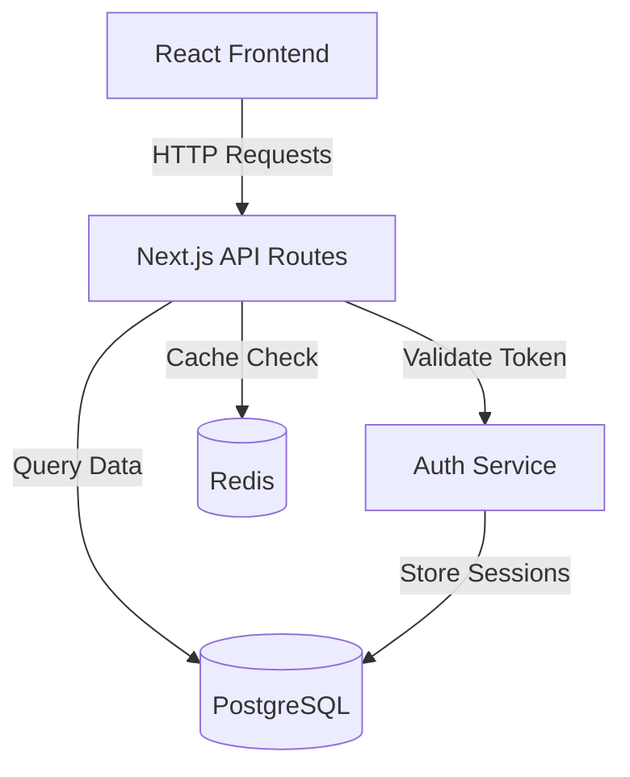

# Curious Bob - Improvements Plan
## Enhanced Repository Analysis & Multi-Perspective Module Insights

---

## Executive Summary

This document outlines two major feature enhancements to Curious Bob:

1. **Phase 3: Enhanced Repository Overview** - Comprehensive system analysis including architecture diagrams, file tree visualization, and database schema detection
2. **Phase 4: Multi-Perspective Module Analysis** - Stakeholder-specific analysis modes with tailored prompts for different engineering roles

These improvements transform Curious Bob from a basic code analyzer into a comprehensive codebase intelligence platform that serves multiple stakeholders with role-specific insights.

---

## Table of Contents

1. [Current State Analysis](#current-state-analysis)
2. [Phase 3: Enhanced Repository Overview](#phase-3-enhanced-repository-overview)
3. [Phase 4: Multi-Perspective Module Analysis](#phase-4-multi-perspective-module-analysis)
4. [UI/UX Design Specifications](#uiux-design-specifications)
5. [Prompt Engineering Strategy](#prompt-engineering-strategy)
6. [Implementation Roadmap](#implementation-roadmap)
7. [Technical Considerations](#technical-considerations)
8. [Success Metrics](#success-metrics)

---

## Current State Analysis

### Existing Functionality

**Phase 1 (Overview API)**: `/api/overview`
- Fetches repository metadata from GitHub
- Analyzes file structure (first 100 files)
- Reads package.json for dependencies
- Returns 3-5 logical modules with basic descriptions

**Phase 2 (Module Analysis API)**: `/api/module`
- Fetches file contents (max 20 files)
- Analyzes code with single default perspective
- Generates 3-10 tickets assigned to default team
- Returns tickets with code locations and actions

### Current Limitations

1. **Limited Overview Depth**
   - No system architecture visualization
   - No database schema detection
   - No component interaction mapping
   - Basic file tree representation

2. **Single Analysis Perspective**
   - One-size-fits-all analysis approach
   - No stakeholder-specific insights
   - Generic ticket generation
   - Limited context for different roles

3. **UI Constraints**
   - No visual architecture diagrams in overview
   - No perspective selection interface
   - Limited context for decision-making
   - No role-based filtering

---

## Phase 3: Enhanced Repository Overview

### Objective

Transform the repository overview from a simple module list into a comprehensive system intelligence dashboard that provides:
- **System Architecture**: Visual component interaction diagrams
- **File Tree Visualization**: Interactive, filterable file structure
- **Database Schema**: Detected database models and relationships
- **Technology Landscape**: Comprehensive tech stack analysis
- **Entry Points**: Identified main application entry points

### Feature Specifications

#### 3.1 System Architecture Analysis

**What It Does**:
- Analyzes repository structure to identify main components
- Maps component interactions and dependencies
- Generates Mermaid architecture diagrams
- Identifies architectural patterns (MVC, microservices, etc.)

**Data Structure**:
```typescript
interface ArchitectureAnalysis {
  pattern: 'MVC' | 'Microservices' | 'Monolithic' | 'Serverless' | 'Layered' | 'Event-Driven';
  components: Component[];
  interactions: Interaction[];
  diagram: {
    type: 'mermaid';
    content: string;
    description: string;
  };
  entryPoints: EntryPoint[];
}

interface Component {
  id: string;
  name: string;
  type: 'frontend' | 'backend' | 'database' | 'service' | 'api' | 'middleware';
  description: string;
  files: string[];
  dependencies: string[];
}

interface Interaction {
  from: string; // component id
  to: string;   // component id
  type: 'http' | 'database' | 'event' | 'import' | 'api-call';
  description: string;
}

interface EntryPoint {
  file: string;
  type: 'server' | 'client' | 'cli' | 'worker';
  description: string;
}
```

**Example Diagram Output**:


#### 3.2 Database Schema Detection

**What It Does**:
- Scans for database models (Prisma, TypeORM, Sequelize, etc.)
- Extracts table definitions and relationships
- Generates entity-relationship diagrams
- Identifies database type (PostgreSQL, MySQL, MongoDB, etc.)

**Data Structure**:
```typescript
interface DatabaseSchema {
  type: 'sql' | 'nosql' | 'mixed' | 'none';
  provider?: 'postgresql' | 'mysql' | 'mongodb' | 'sqlite' | 'redis';
  orm?: 'prisma' | 'typeorm' | 'sequelize' | 'mongoose' | 'drizzle';
  models: DatabaseModel[];
  relationships: Relationship[];
  diagram: {
    type: 'mermaid';
    content: string;
    description: string;
  };
}

interface DatabaseModel {
  name: string;
  file: string;
  fields: Field[];
  indexes: string[];
}

interface Field {
  name: string;
  type: string;
  required: boolean;
  unique: boolean;
  defaultValue?: string;
}

interface Relationship {
  from: string; // model name
  to: string;   // model name
  type: 'one-to-one' | 'one-to-many' | 'many-to-many';
  description: string;
}
```

**File Patterns to Detect**:
- `schema.prisma` (Prisma)
- `**/models/*.ts` (TypeORM, Sequelize)
- `**/entities/*.ts` (TypeORM)
- `**/schemas/*.ts` (Mongoose)
- `migrations/` directory

#### 3.3 File Tree Structure Visualization

**Data Structure**:
```typescript
interface FileTreeNode {
  name: string;
  path: string;
  type: 'file' | 'directory';
  size?: number;
  lines?: number;
  language?: string;
  importance?: 'critical' | 'high' | 'medium' | 'low';
  children?: FileTreeNode[];
}

interface FileTreeAnalysis {
  tree: FileTreeNode;
  statistics: {
    totalFiles: number;
    totalDirectories: number;
    totalLines: number;
    languageBreakdown: { language: string; percentage: number }[];
  };
  criticalFiles: string[];
  configFiles: string[];
}
```

#### 3.4 Enhanced Overview API Response

```typescript
interface EnhancedOverviewResponse {
  repository: {
    owner: string;
    repo: string;
    description: string;
    language: string;
    stars: number;
    url: string;
  };
  
  // Existing fields
  modules: Module[];
  totalFiles: number;
  hasPackageJson: boolean;
  
  // NEW: Architecture analysis
  architecture: ArchitectureAnalysis;
  
  // NEW: File tree
  fileTree: FileTreeAnalysis;
  
  // NEW: Database schema
  database: DatabaseSchema;
  
  // NEW: Enhanced tech stack
  techStack: {
    frameworks: string[];
    languages: { name: string; percentage: number }[];
    databases: string[];
    infrastructure: string[];
    testing: string[];
  };
  
  // NEW: README summary
  readme: {
    summary: string;
    sections: { title: string; content: string }[];
  };
}
```

---

## Phase 4: Multi-Perspective Module Analysis

### Objective

Enable stakeholder-specific analysis by allowing users to select analysis perspectives that tailor the LLM prompts, ticket generation, and insights to specific roles and concerns.

### Available Perspectives

1. **Business Logic Analysis** (Stakeholders/Product Managers)
   - Focus: Business rules, workflows, feature completeness
   - Output: Feature gaps, business logic bugs, workflow improvements
   - Assignees: Product Manager, Business Analyst, Tech Lead

2. **Technical Debt & Code Quality** (Developers)
   - Focus: Code smells, refactoring opportunities, maintainability
   - Output: Refactoring tickets, code quality improvements
   - Assignees: Senior SWE, Tech Lead, Junior SWE

3. **Security Vulnerabilities** (Security Engineers)
   - Focus: Security flaws, injection risks, authentication issues
   - Output: Security tickets, vulnerability reports, compliance gaps
   - Assignees: Cybersecurity Engineer, Senior SWE

4. **UI/UX Improvements** (Frontend Developers)
   - Focus: Accessibility, responsiveness, user experience
   - Output: UI enhancement tickets, accessibility fixes
   - Assignees: Frontend Developer, UX Designer

5. **Performance & Scalability** (DevOps/Backend)
   - Focus: Bottlenecks, optimization opportunities, scalability
   - Output: Performance tickets, optimization suggestions
   - Assignees: DevOps Engineer, Backend Developer

6. **Database & Data Management** (Database Engineers)
   - Focus: Query optimization, schema design, data integrity
   - Output: Database tickets, migration suggestions
   - Assignees: Database Engineer, Backend Developer

7. **Testing & Quality Assurance** (QA Engineers)
   - Focus: Test coverage, edge cases, testing strategy
   - Output: Testing tickets, QA improvements
   - Assignees: QA Engineer, Test Automation Engineer

8. **DevOps & Infrastructure** (DevOps Engineers)
   - Focus: CI/CD, deployment, monitoring, infrastructure
   - Output: DevOps tickets, infrastructure improvements
   - Assignees: DevOps Engineer, SRE

9. **API Design & Documentation** (API Developers)
   - Focus: API consistency, documentation, versioning
   - Output: API improvement tickets, documentation tasks
   - Assignees: API Developer, Technical Writer

10. **Accessibility Compliance** (Accessibility Specialists)
    - Focus: WCAG compliance, screen reader support, keyboard navigation
    - Output: Accessibility tickets, compliance reports
    - Assignees: Accessibility Specialist, Frontend Developer

### Perspective-Specific Response Schema

```typescript
interface PerspectiveAnalysisResponse {
  perspective: AnalysisPerspective;
  
  tickets: Ticket[]; // Perspective-specific tickets
  
  // NEW: Perspective-specific insights
  perspectiveInsights: {
    summary: string;
    keyFindings: string[];
    recommendations: string[];
    metrics?: Record<string, number | string>;
  };
  
  // Optional existing fields
  risks?: Risk[];
  insights?: GeneralInsights;
  diagram?: Diagram;
  onboardingGuide?: OnboardingGuide;
}
```

---

## UI/UX Design Specifications

### Enhanced Overview Page Layout

```
┌─────────────────────────────────────────────────────┐
│  Curious Bob                              [🌙 Theme] │
├─────────────────────────────────────────────────────┤
│                                                       │
│  Repository: owner/repo                    ⭐ 1.2k  │
│  Description: E-commerce platform...                │
│                                                       │
│  [Overview] [Architecture] [Database] [File Tree]   │
│  ─────────────────────────────────────────────────  │
│                                                       │
│  System Architecture                    [Fullscreen] │
│  ┌─────────────────────────────────────────────┐   │
│  │                                              │   │
│  │     [Mermaid Architecture Diagram]          │   │
│  │                                              │   │
│  └─────────────────────────────────────────────┘   │
│                                                       │
│  Pattern: Monolithic MVC                            │
│  Components: 5 identified                           │
│  Entry Points: src/index.ts, src/app.tsx           │
│                                                       │
│  Database Schema                        [Fullscreen] │
│  ┌─────────────────────────────────────────────┐   │
│  │                                              │   │
│  │     [Mermaid ER Diagram]                    │   │
│  │                                              │   │
│  └─────────────────────────────────────────────┘   │
│                                                       │
│  Type: SQL (PostgreSQL) • ORM: Prisma               │
│  Models: 8 tables • Relationships: 12               │
│                                                       │
│  Detected Modules                                    │
│  ┌──────────┐ ┌──────────┐ ┌──────────┐           │
│  │ Auth     │ │ Payment  │ │ Inventory│           │
│  │ 12 files │ │ 8 files  │ │ 15 files │           │
│  │ [Select] │ │ [Select] │ │ [Select] │           │
│  └──────────┘ └──────────┘ └──────────┘           │
│                                                       │
└─────────────────────────────────────────────────────┘
```

### Perspective Selection Interface

```
┌─────────────────────────────────────────────────────┐
│  Analyze Module: Authentication                      │
├─────────────────────────────────────────────────────┤
│                                                       │
│  Select Analysis Perspective                         │
│                                                       │
│  ┌─────────────────┐ ┌─────────────────┐           │
│  │ 💼 Business     │ │ 🔧 Technical    │           │
│  │    Logic        │ │    Debt         │           │
│  │                 │ │                 │           │
│  │ For: PM, BA     │ │ For: Developers │           │
│  │ ○ Select        │ │ ○ Select        │           │
│  └─────────────────┘ └─────────────────┘           │
│                                                       │
│  ┌─────────────────┐ ┌─────────────────┐           │
│  │ 🔒 Security     │ │ 🎨 UI/UX        │           │
│  │    Audit        │ │    Review       │           │
│  │                 │ │                 │           │
│  │ For: SecEng     │ │ For: Frontend   │           │
│  │ ● Selected      │ │ ○ Select        │           │
│  └─────────────────┘ └─────────────────┘           │
│                                                       │
│  [Show 6 More Perspectives ▼]                       │
│                                                       │
│  Team Roster (Auto-adjusted for Security)           │
│  • Cybersecurity Engineer                           │
│  • Senior SWE                                        │
│  • Tech Lead                                         │
│  [Customize Team]                                    │
│                                                       │
│  Estimated Analysis Time: 45-60 seconds             │
│                                                       │
│              [Analyze with Security Perspective]     │
│                                                       │
└─────────────────────────────────────────────────────┘
```

### Perspective-Specific Results Display

```
┌─────────────────────────────────────────────────────┐
│  ← Back to Modules            owner/repo    [Export] │
├─────────────────────────────────────────────────────┤
│                                                       │
│  Authentication Module                               │
│  [🔒 Security Audit Perspective]                    │
│                                                       │
│  Security Score: 42/100 ⚠️                          │
│  Critical Issues: 2 | High: 3 | Medium: 5           │
│                                                       │
│  Key Findings:                                       │
│  • JWT secret hardcoded in source code (CRITICAL)   │
│  • No rate limiting on authentication endpoints     │
│  • SQL injection vulnerability in user search       │
│                                                       │
│  [Tickets] [Risks] [Insights] [Recommendations]     │
│  ─────────────────────────────────────────────────  │
│                                                       │
│  ┌─────────────────────────────────────────────┐   │
│  │ CB-AUTH-SEC-001           [Critical] 🔴     │   │
│  │ Remove hardcoded JWT secret                 │   │
│  │ OWASP: A02:2021 - Cryptographic Failures   │   │
│  │                                              │   │
│  │ Security Impact: Complete auth bypass       │   │
│  │ Files: src/lib/auth/jwt.ts (lines 5-7)     │   │
│  │                                              │   │
│  │ [View Details] [Mark as Done]               │   │
│  └─────────────────────────────────────────────┘   │
│                                                       │
└─────────────────────────────────────────────────────┘
```

---

## Prompt Engineering Strategy

### Phase 3: Enhanced Overview Prompt

```typescript
const enhancedOverviewPrompt = `
Analyze this repository comprehensively and provide a detailed overview.

REPOSITORY: ${owner}/${repo}
DESCRIPTION: ${description}
LANGUAGE: ${language}
STARS: ${stars}

FILE TREE (${fileCount} files):
${fileTreeString}

CONFIGURATION FILES:
${configFiles.map(f => `--- ${f.path} ---\n${f.content}`).join('\n')}

${readme ? `README:\n${readme}` : ''}

${databaseFiles.length > 0 ? `DATABASE SCHEMA FILES:\n${databaseFiles.map(f => `--- ${f.path} ---\n${f.content}`).join('\n')}` : ''}

ANALYSIS REQUIREMENTS:

1. SYSTEM ARCHITECTURE
   - Identify architectural pattern
   - Map main components and responsibilities
   - Identify component interactions
   - Generate Mermaid architecture diagram
   - Identify entry points

2. DATABASE SCHEMA (if applicable)
   - Detect database type and ORM
   - Extract table/model definitions
   - Identify relationships
   - Generate ER diagram

3. FILE STRUCTURE
   - Categorize files by importance
   - Identify critical files
   - Note unusual patterns

4. TECHNOLOGY STACK
   - List frameworks and libraries
   - Language breakdown
   - Infrastructure tools

5. LOGICAL MODULES
   - Identify 3-8 modules
   - Each with 5-50 files
   - Clear descriptions

Respond with JSON matching the enhanced schema.
`;
```

### Phase 4: Perspective-Specific Prompts

#### Security Audit Perspective

```typescript
const securityAuditPrompt = `
You are a cybersecurity engineer performing a security audit.

MODULE: ${moduleName}
FILES: ${files.length} analyzed

SOURCE CODE:
${files.map(f => `=== ${f.path} ===\n${f.content}`).join('\n')}

SECURITY FOCUS AREAS:

1. Authentication & Authorization
   - JWT handling, session management
   - Password storage, RBAC
   - Token expiration

2. Input Validation & Injection
   - SQL injection, XSS, command injection
   - Path traversal, LDAP injection

3. Sensitive Data Exposure
   - Hardcoded secrets, exposed PII
   - Insecure storage, logging sensitive data

4. Dependency Vulnerabilities
   - Outdated packages with CVEs
   - Vulnerable dependencies

5. Security Best Practices
   - HTTPS, CORS, rate limiting
   - Security headers, error handling

TICKET CATEGORIES:
- Critical Vulnerability
- Authentication Flaw
- Data Exposure
- Injection Risk
- Dependency Vulnerability
- Security Best Practice

Generate tickets with:
- CVE numbers if applicable
- OWASP Top 10 references
- Exploit scenarios
- Specific security fixes
- Code examples

Respond with JSON including perspectiveInsights with security metrics.
`;
```

#### Business Logic Perspective

```typescript
const businessLogicPrompt = `
You are a business analyst reviewing code for business logic correctness.

MODULE: ${moduleName}
FILES: ${files.length} analyzed

SOURCE CODE:
${files.map(f => `=== ${f.path} ===\n${f.content}`).join('\n')}

BUSINESS FOCUS AREAS:

1. Business Rules Implementation
   - Correct implementation
   - Edge case handling
   - Validation completeness

2. Workflow Completeness
   - End-to-end workflows
   - Missing steps
   - Error scenarios

3. Feature Gaps
   - Partial implementations
   - Missing requirements
   - Inconsistencies

4. Data Validation
   - Business constraints
   - Data integrity
   - Validation layers

TICKET CATEGORIES:
- Feature Gap
- Business Logic Bug
- Workflow Improvement
- Data Validation Issue
- Business Rule Violation

Generate tickets with:
- Business impact explanation
- Concrete examples
- Business-aligned solutions
- Stakeholder perspectives

Respond with JSON including perspectiveInsights with business metrics.
`;
```

#### UI/UX Perspective

```typescript
const uiUxPrompt = `
You are a frontend developer and UX specialist reviewing UI/UX.

MODULE: ${moduleName}
FILES: ${files.length} analyzed

SOURCE CODE:
${files.map(f => `=== ${f.path} ===\n${f.content}`).join('\n')}

UI/UX FOCUS AREAS:

1. Accessibility (WCAG 2.1 AA)
   - Semantic HTML, ARIA labels
   - Keyboard navigation
   - Screen reader support
   - Color contrast

2. Responsive Design
   - Mobile responsiveness
   - Breakpoints, touch targets
   - Viewport configuration

3. User Experience
   - Loading states, error messages
   - Form validation feedback
   - Navigation clarity

4. Performance
   - Image optimization
   - Lazy loading, bundle size
   - Render performance

5. Design Consistency
   - Component reusability
   - Design system adherence
   - Spacing and typography

TICKET CATEGORIES:
- Accessibility Issue
- Responsive Design Bug
- UX Improvement
- Performance Optimization
- Design Inconsistency

Generate tickets with:
- WCAG guideline references
- Specific UI components
- Before/after examples
- Design patterns

Respond with JSON including perspectiveInsights with UX metrics.
`;
```

---

## Implementation Roadmap

### Phase 3 Implementation (2-3 days)

#### Day 1: Backend Infrastructure
- [ ] Update GitHub API client to fetch README and database files
- [ ] Create architecture analysis function in LLM module
- [ ] Create database schema analysis function
- [ ] Update overview API route with new analysis
- [ ] Test with sample repositories

#### Day 2: Frontend Components
- [ ] Create Architecture Diagram component (Mermaid)
- [ ] Create Database Schema Diagram component
- [ ] Create File Tree visualization component
- [ ] Update overview page layout with new sections
- [ ] Add tab navigation for different views

#### Day 3: Integration & Testing
- [ ] Integrate all components
- [ ] Test with various repository types
- [ ] Handle edge cases (no database, no README)
- [ ] Performance optimization
- [ ] Documentation

### Phase 4 Implementation (3-4 days)

#### Day 1: Perspective Infrastructure
- [ ] Define all perspective types and schemas
- [ ] Create perspective-specific prompt templates
- [ ] Update module analysis API to accept perspective
- [ ] Create perspective insights response structure

#### Day 2: Perspective Prompts
- [ ] Implement all 10 perspective prompts
- [ ] Test each perspective with sample code
- [ ] Refine prompts based on output quality
- [ ] Add perspective-specific team rosters

#### Day 3: Frontend UI
- [ ] Create perspective selection component
- [ ] Create perspective card grid
- [ ] Update results page with perspective badge
- [ ] Add perspective-specific insights section
- [ ] Create perspective comparison view (future)

#### Day 4: Integration & Testing
- [ ] Test all perspectives end-to-end
- [ ] Validate ticket quality per perspective
- [ ] Performance testing
- [ ] User acceptance testing
- [ ] Documentation

---

## Technical Considerations

### Performance Optimization

1. **Caching Strategy**
   - Cache overview results for 5 minutes
   - Cache README and database schema files
   - Use Redis for production caching

2. **Token Management**
   - Monitor Gemini token usage per perspective
   - Implement token budgets per analysis
   - Optimize prompt length

3. **Parallel Processing**
   - Fetch multiple files concurrently
   - Parallel LLM calls where possible
   - Stream responses for better UX

### Error Handling

1. **Graceful Degradation**
   - If architecture analysis fails, show basic overview
   - If database detection fails, skip that section
   - Provide fallback for missing README

2. **User Feedback**
   - Clear error messages
   - Retry mechanisms
   - Progress indicators

### Security Considerations

1. **Input Validation**
   - Validate repository URLs
   - Sanitize file contents
   - Rate limit API calls

2. **Data Privacy**
   - Don't store repository contents
   - Clear session data after analysis
   - Respect GitHub API rate limits

---

## Success Metrics

### Phase 3 Metrics

1. **Accuracy**
   - Architecture diagram accuracy: >85%
   - Database schema detection: >90%
   - Component identification: >80%

2. **Performance**
   - Overview analysis time: <60 seconds
   - Diagram generation: <5 seconds
   - Page load time: <2 seconds

3. **User Satisfaction**
   - User finds architecture diagram helpful: >80%
   - Database schema visualization useful: >75%
   - Overall overview satisfaction: >85%

### Phase 4 Metrics

1. **Ticket Quality**
   - Perspective-relevant tickets: >90%
   - Actionable tickets: >85%
   - Accurate code references: >90%

2. **Perspective Effectiveness**
   - Security perspective finds vulnerabilities: >80%
   - Business perspective identifies gaps: >75%
   - UI/UX perspective finds accessibility issues: >70%

3. **User Adoption**
   - Users try multiple perspectives: >60%
   - Perspective selection satisfaction: >85%
   - Return usage rate: >50%

---

## Future Enhancements

### Phase 5: Advanced Features

1. **Multi-Module Analysis**
   - Analyze multiple modules simultaneously
   - Cross-module dependency analysis
   - System-wide insights

2. **Perspective Combinations**
   - Combine multiple perspectives
   - Weighted perspective analysis
   - Custom perspective creation

3. **Historical Analysis**
   - Track changes over time
   - Compare analysis results
   - Trend identification

4. **Integration Enhancements**
   - Direct Jira/GitHub Issues export
   - Slack/Teams notifications
   - CI/CD integration

5. **AI Improvements**
   - Fine-tuned models per perspective
   - Learning from user feedback
   - Automated ticket prioritization

---

## Conclusion

These improvements will significantly enhance Curious Bob's value proposition by:

1. **Providing Comprehensive Context**: Architecture and database diagrams give users immediate understanding of system structure
2. **Serving Multiple Stakeholders**: Perspective-specific analysis ensures relevant insights for different roles
3. **Improving Decision Making**: Better context and role-specific insights lead to more informed decisions
4. **Increasing Adoption**: More valuable features drive higher user engagement and retention

The phased approach allows for iterative development and validation, ensuring each feature delivers value before moving to the next.

---

## Appendix

### A. Complete Perspective List

1. Business Logic Analysis
2. Technical Debt & Code Quality
3. Security Vulnerabilities
4. UI/UX Improvements
5. Performance & Scalability
6. Database & Data Management
7. Testing & Quality Assurance
8. DevOps & Infrastructure
9. API Design & Documentation
10. Accessibility Compliance

### B. Technology Stack Requirements

**New Dependencies**:
- `mermaid` - Diagram rendering
- `react-syntax-highlighter` - Code display
- `@mui/x-tree-view` - File tree component (optional)

**API Changes**:
- `/api/overview` - Enhanced response schema
- `/api/module` - Add perspective parameter

### C. Estimated Costs

**Gemini API Costs** (per analysis):
- Enhanced Overview: ~$0.002 (vs $0.0015 current)
- Perspective Analysis: ~$0.006 (vs $0.0053 current)
- Total per full analysis: ~$0.008

**Development Time**:
- Phase 3: 2-3 days
- Phase 4: 3-4 days
- Total: 5-7 days

---

*Document Version: 1.0*
*Last Updated: 2026-05-17*
*Author: Planning Mode*
